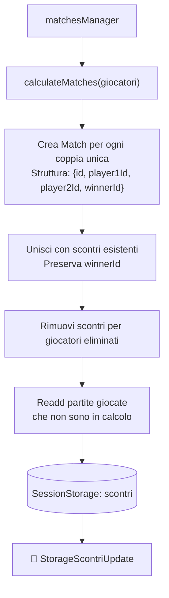
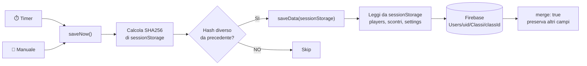
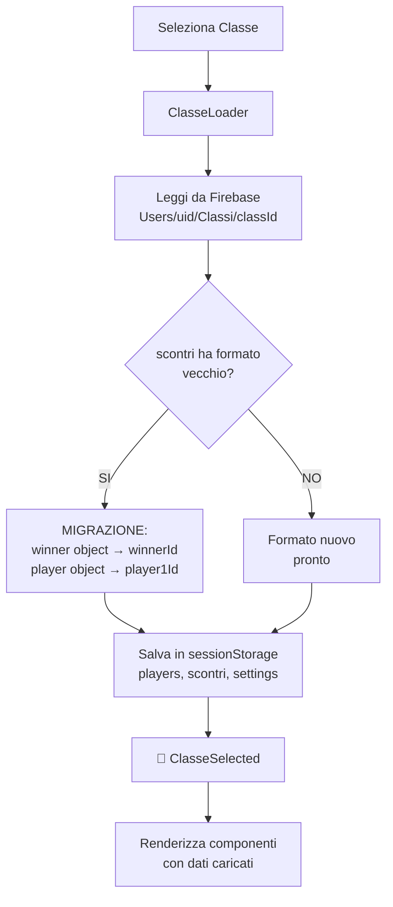

# Campionati IIS Falcone-Righi
Applicazione sviluppata in React Vite che serve a gestire i campionati scolastici (specialmente di ping pong) nel nostro istituto. Ho reso il codice open source perchè non penso di mantenere questa webapp per molto quindi aprendo il codice chi ha voglia può apportare eventuali modifiche richieste dai professori.

## Architettura e Flusso dei Dati

### 1. Aggiunta Giocatori
```mermaid
graph TD
    input1[Numero Input] --> add[Aggiungi Giocatori]
    input2[Nome Input] --> add
    add --> logic{Opzione}
    logic -->|Numero| check[Controlla numeri già esistenti]
    logic -->|Nome| check
    check --> players[(SessionStorage: players)]
    add --> players
    players --> event1["🔔 StorageAddPlayers"]
    event1 --> matchMgr["matchesManager<br/>(ScontriManager)"]
    event1 --> display1>["📊 ElencoGiocatori"]]
```

### 2. Modifica Giocatori (Nome/Elimina)
```mermaid
graph TD
    display1>["📊 ElencoGiocatori"]] --> action{Azione}
    action -->|Rinomina| edit["modifyPlayers.js<br/>(action: 'edit')"]
    action -->|Elimina| delete["modifyPlayers.js<br/>(action: 'delete')"]
    action -->|Elimina Tutti| deleteAll["modifyPlayers.js<br/>(action: 'delete_all')"]
    
    edit --> players[(SessionStorage: players)]
    delete --> players
    deleteAll --> players
    deleteAll --> scontri[(SessionStorage: scontri)]
    deleteAll --> clear["Cancella scontri"]
    clear --> scontri
    
    edit --> event2["🔔 StoragePlayerEdit"]
    delete --> event2
    deleteAll --> event2
    
    event2 --> matchMgr["matchesManager<br/>- Legge players aggiornati<br/>- Migra nomi da player1Id → player1Id<br/>- Preserva winnerId"]
    matchMgr --> scontri
    matchMgr --> event3["🔔 StorageScontriUpdate"]
```

### 3. Calcolo Scontri (Matches)

```mermaid
graph TD
    matchMgr["matchesManager"] --> calc["calculateMatches(giocatori)"]
    calc --> logic["Crea Match per ogni coppia unica<br/>Struttura: {id, player1Id, player2Id, winnerId}"]
    logic --> merge["Unisci con scontri esistenti<br/>Preserva winnerId"]
    merge --> filter["Rimuovi scontri per giocatori eliminati"]
    filter --> addBack["Readd partite giocate<br/>che non sono in calcolo"]
    addBack --> scontri[(SessionStorage: scontri)]
    scontri --> event3["🔔 StorageScontriUpdate"]
```

### 4. Aggiunta Risultati
```mermaid
graph TD
    display2>["🎮 ElencoScontriDaGiocare"]] --> win["Clicca 🏆"]
    win --> addRes["addResult(scontroId, playerId)"]
    addRes --> update["Imposta winnerId = playerId"]
    update --> scontri[(SessionStorage: scontri)]
    scontri --> event3["🔔 StorageScontriUpdate"]
    event3 --> display3>["🎮 ElencoScontriGiocati"]]
    event3 --> display4>["🏆 Classifica"]]
    event3 --> display5>["📈 Grafico"]]
```

### 5. Modifica Risultati
```mermaid
graph TD
    display3>["🎮 ElencoScontriGiocati"]] --> switch["Clicca ↔️ per invertire"]
    switch --> modRes["modifyResult(scontroId)"]
    modRes --> logic["Trova vincitore attuale<br/>Imposta winnerId all'altro giocatore"]
    logic --> addRes["addResult(scontroId, newPlayerId)"]
    addRes --> scontri[(SessionStorage: scontri)]
    scontri --> event3["🔔 StorageScontriUpdate"]
```

### 6. Visualizzazione Dati
```mermaid
graph TD
    scontri[(SessionStorage: scontri)] --> disp{Componente}
    players[(SessionStorage: players)] --> disp
    
    disp -->|ElencoScontriDaGiocare| e1["Filtra: winnerId == null<br/>getPlayerName(player1Id, players)"]
    disp -->|ElencoScontriGiocati| e2["Filtra: winnerId != null<br/>getPlayerName(player1Id, players)"]
    disp -->|Classifica| e3["Filtra: winnerId != null<br/>Conta vittorie per winnerId<br/>getPlayerName(winnerId, players)"]
    disp -->|Grafico| e4["Conta match da giocare vs giocati"]
    
    e1 --> out1>["📊 Lista scontri da giocare"]]
    e2 --> out2>["📊 Lista scontri giocati"]]
    e3 --> out3>["🏆 Top 3 vincitori"]]
    e4 --> out4>["📈 Torta giocati/da giocare"]]
```

### 7. Salvataggio su Firebase

```mermaid
graph LR
    timer["⏱️ Timer"] --> saveNow["saveNow()"]
    manual["💾 Manuale"] --> saveNow
    
    saveNow --> hash["Calcola SHA256<br/>di sessionStorage"]
    hash --> compare{"Hash diverso<br/>da precedente?"}
    compare -->|SI| save["saveData(sessionStorage)"]
    compare -->|NO| skip["Skip"]
    
    save --> data["Leggi da sessionStorage<br/>players, scontri, settings"]
    data --> firebase[(Firebase<br/>Users/uid/Classi/classId)]
    firebase --> note["merge: true<br/>preserva altri campi"]
```

### 8. Caricamento da Firebase

```mermaid
graph TD
    select["Seleziona Classe"] --> load["ClasseLoader"]
    load --> fetch["Leggi da Firebase<br/>Users/uid/Classi/classId"]
    fetch --> check{"scontri ha formato<br/>vecchio?"}
    
    check -->|SI| migrate["MIGRAZIONE:<br/>winner object → winnerId<br/>player object → player1Id"]
    check -->|NO| noMigrate["Formato nuovo<br/>pronto"]
    
    migrate --> session["Salva in sessionStorage<br/>players, scontri, settings"]
    noMigrate --> session
    
    session --> event["🔔 ClasseSelected"]
    event --> render["Renderizza componenti<br/>con dati caricati"]
```

## Struttura Dati

### SessionStorage
```json
{
  "players": [
    { "id": 1, "name": "Mario Rossi" },
    { "id": 2, "name": "Luigi Bianchi" }
  ],
  "scontri": [
    {
      "id": "1|2",
      "player1Id": 1,
      "player2Id": 2,
      "winnerId": 1  // null se non giocato
    }
  ],
  "settings": {
    "saveTimer": 30000,
    "returnMatches": false
  }
}
```

### Firebase (Users/uid/Classi/classId)
Stessa struttura di SessionStorage, salvata con `merge: true` per preservare campi aggiuntivi.

## Componenti Principali

### Scripts
- `calculateMatches.js` - Calcola tutte le partite possibili tra i giocatori
- `addResult.js` - Aggiunge un risultato a una partita
- `modifyResult.js` - Inverte il vincitore di una partita
- `matchesManager.js` - Gestisce la sincronizzazione dei calcoli con i giocatori
- `modifyPlayers.js` - Modifica giocatori (rinomina, elimina)
- `Save.js` - Salva periodicamente su Firebase

### Components
- `ElencoGiocatori.jsx` - Lista e gestione giocatori
- `ElencoScontriDaGiocare.jsx` - Partite non ancora giocate
- `ElencoScontriGiocati.jsx` - Partite già giocate
- `Classifica.jsx` - Ranking dei vincitori
- `Grafico.jsx` - Grafico torta match/non-match
- `ClasseLoader.jsx` - Caricamento classi da Firebase (con migrazione dati)

### Utilities
- `getPlayerName.js` - Lookup nome giocatore da ID (single source of truth)

## Sistema di Eventi

L'app usa eventi personalizzati per comunicare tra componenti:
- `StorageAddPlayers` - Nuovo giocatore aggiunto
- `StoragePlayerEdit` - Giocatore modificato (nome/elimina)
- `StorageScontriUpdate` - Match modificati (nuovo risultato, etc)
- `TabSwitch` - Tab di risultati cambiato (Add/View)
- `ClasseSelected` - Classe caricata da Firebase
- `SettingsUpdate` - Impostazioni cambiate

## Flusso Principale

1. **Aggiunta Giocatori** → `StorageAddPlayers` → `matchesManager` ricalcola match
2. **Rinomina Giocatore** → `StoragePlayerEdit` → `matchesManager` aggiorna nomi (preserva winnerId)
3. **Aggiunta Risultato** → `addResult` → `StorageScontriUpdate` → Componenti si aggiornano
4. **Auto-save** → Ogni 30s legge sessionStorage → Confronta hash → Se diverso, salva su Firebase
5. **Caricamento Classe** → Legge Firebase → Migra dati vecchi → Carica in sessionStorage

## Note Tecniche

- **Single Source of Truth**: Nomi dei giocatori solo nell'array `players`
- **Match IDs**: Formato `player1Id|player2Id` (immutabile per ogni coppia)
- **Winner Storage**: Solo `winnerId` (ID del giocatore), il nome viene risolto al momento del render
- **Backward Compatibility**: ClasseLoader migra automaticamente dati vecchi (formato `winner` object) al nuovo formato (ID-based)
- **Merge on Save**: Firebase salva con `merge: true` per evitare perdita di dati
